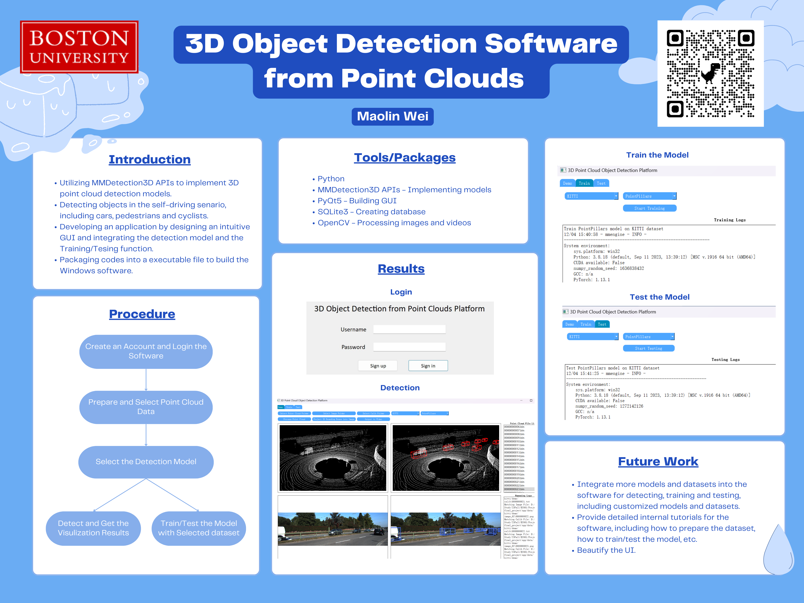

# Final Project - 3D Object Detection Software from Point Clouds



## Introduction
The project is to build the a software platform for object detection in 3D point cloud data. It leverages OpenMMLab's [MMDetection3D](https://github.com/thePegasusai/mmdetection3d) toolbox to process point cloud data, implement the detection model, train/test the model, etc. With an intuitive GUI, it allows users easier utilize advanced algorithms for 3D Object detection from point cloud data, providing a efficient way for a wide range of applications in fields like robotics, autonomous vehicles, an so on.

### Major Features
- **Graphical User Interface (GUI)**: An intuitive GUI, designed in Python PyQt5, facilitating seamless interaction with the software's functionalities. The GUI includes Login windows, detecting, training and testing tabs.  
- **Sign up/in Module**: Provides registration and login window to ensure authorized access to the software.  
- **Detecting Module**: Provides pretrained models on point cloud datasets. Users can upload the point cloud data and visualize the detection results.  
- **Training Module**: Enables users to train their own detection model with selected datasets.  
- **Testing Module**: Enables users to test trained models on selected datasets, offering insights into model performance and accuracy.  

## Getting Started
### Installation
- **MMDection3D**: Please refer to [MMDetection3D's document](https://github.com/thePegasusai/mmdetection3d/blob/master/docs/en/getting_started.md) for installation.
- PyQt5
- OpenCV

### Data Preparation
Download the dataset and put it in data/.  
For example, for KITTI dataset, the folder structure should be like below:  

    ROOT  
    ├── data  
    │   ├── kitti  
    │   │   │── ImageSets  
    │   │   │── training  
    │   │   │   ├──calib & velodyne & label_2 & image_2  
    │   │   │── testing  
    │   │   │   ├──calib & velodyne & image_2  
    ├── configs  
    ├── mmdet3d  
    ├── tools  

## Reference
- [MMDetection3D](https://github.com/open-mmlab/mmdetection3d)
```latex
@misc{mmdet3d2020,
    title={{MMDetection3D: OpenMMLab} next-generation platform for general {3D} object detection},
    author={MMDetection3D Contributors},
    howpublished = {\url{https://github.com/open-mmlab/mmdetection3d}},
    year={2020}
}
```
