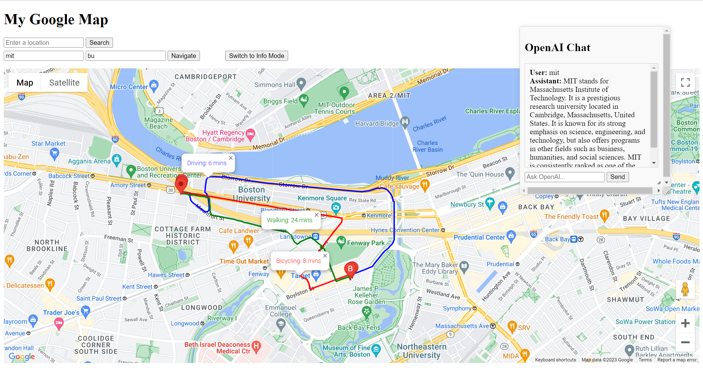

# Project 2
A simple website application built with Google Map APIs and OpenAI APIs

## Introduction
### Product Mission
By integrating the Google Maps with OpenAI chat bot, making it easier for users to discover, navigate, and learn about locations in the world. Users can use it to easily make travel plans. 

### User Stories
1. As a traveler, I want to search for a specific location on the map so I can find out where it's situated.
2. As a tourist, I want to chat with the OpenAI bot to gather detailed information, historical significance, or any recommendations related to the place.
3. As a driver, I want to input two locations and find the best route so I can get to my destination efficiently.
4. As a foodie, I wish to inquire about the best local restaurants in an area and see them on the map.
5. As a business owner, I want to find the best route between two places to efficiently manage deliveries or client visits.
6. As a user, I want a platform that combines map navigation with AI-driven details to enhance my understanding and experience of locations.

### MVP
1. A clean, user-friendly UI that displays a map powered by the Google Maps API and the chatting window.
2. Allow users to input a location to get the information.
3. Allow users to input a starting location and a destination and display the route on the map.
4. Allow users to chat with the OpenAI bot and get information from it.

## Folder Structure
### static folder
This folder is used to store the javascript(.js) files to provide functions to web pages.
**searchLocation.js**: is designed for handling location search functionality. It involves creating a new geocoder object from the Google Maps API, getting the value entered in an address input field, and managing markers and information windows on a map. It is used to allow users to search for specific locations on the map.
**openAI.js**: is designed for retrieving user input and sending it to the backend program to get a response from OpenAI's APIs, and then displays it.
**navigate.js**: is designed for navigation. It includes functions about process the users' location input and get a route between two locations. Also, it can process the location information that the users selected on the map and get detailed information about the location.
**mapInit.js**: is designed for initializing a map. It includes creating a new geocoder object and converting an address into latitude and longitude coordinates. It is used for setting up a basic map view.

### templates folder
The folder is used to store html files, which is the UI of a website.

## Demo
1. Users can enter a location and click "Search" button to display it on the map.
2. Users can enter two locations and click "Navigate" button to get the route between the two locations. Besides, users can click two location on map to get the route when using the "Navigation Mode". The blue line shows the route of driving a car, the red line shows the route of riding a bicycle, and the green line shows the route of walking.
3. The "Switch to Info Mode" button can switch between "Info Mode" and "Navigation Mode". In the "Info Mode", when users click a location on map, it will display a detailed information of the place. In the "Navigation Mode", when users click two locations on map, it will display the routes between the two plcaes.
4. The OpenAI Chat window can make users to chat with the ChatGPT. Users can get some suggestions about restaurants, places of interest, etc. from it, which make them plan their travel easier.

The picture below is a demo of my web application. 


## Getting Started
**openAI_app.py**: is a basic Python web application built with the Flask framework, which integrates OpenAI’s API. 
```
python openAI_app.py
```
When the Flask server runs successfully, open url: http://127.0.0.1:5000 on browser to use the application.
